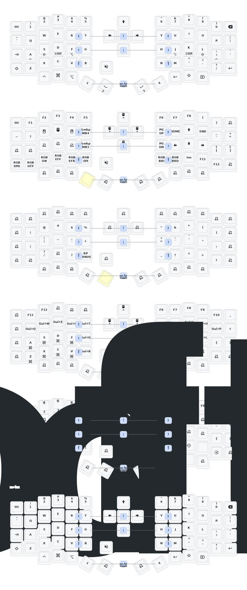

## This was first a fork of [zmk-sofle](https://github.com/a741725193/zmk-sofle) but I have since made it my own.

You can learn more about ZMK here: https://zmk.dev and about the setup of the Sofle keyboard here: https://zmk.dev/docs/user-setup

The list of keycodes: https://zmk.dev/docs/keymaps/list-of-keycodes

Keymaps can also be generated via interface using https://nickcoutsos.github.io/keymap-editor

## Current key map

